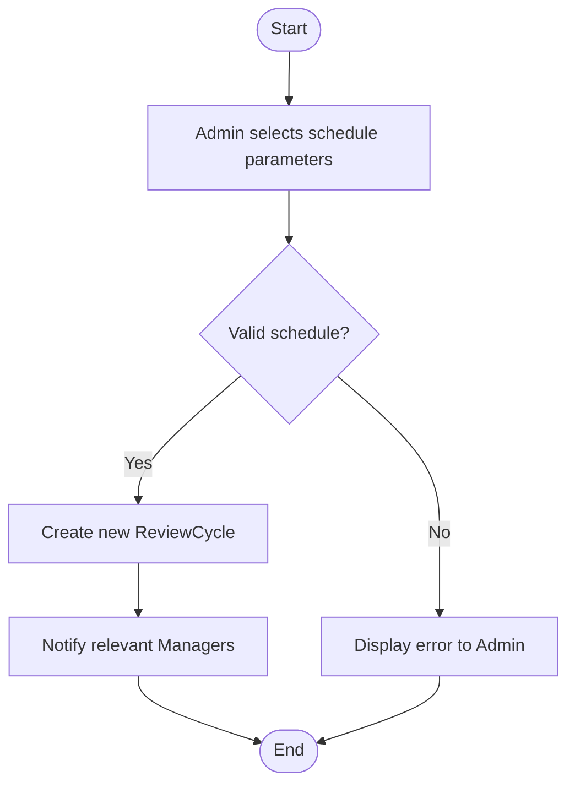
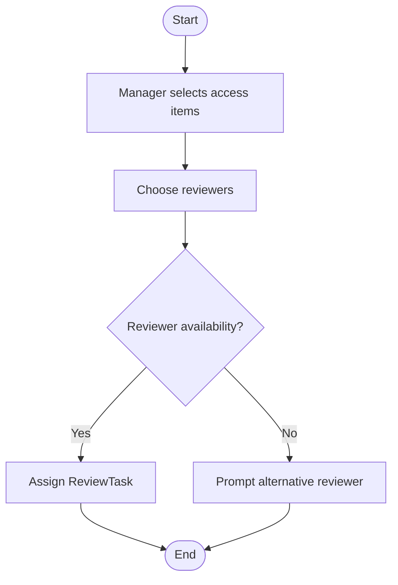
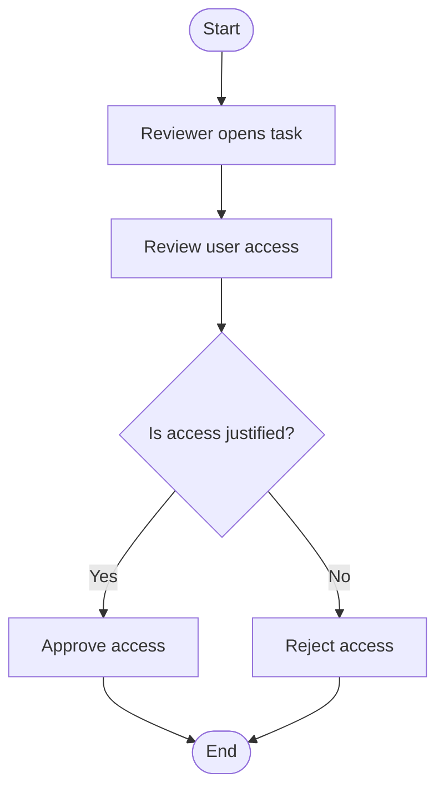
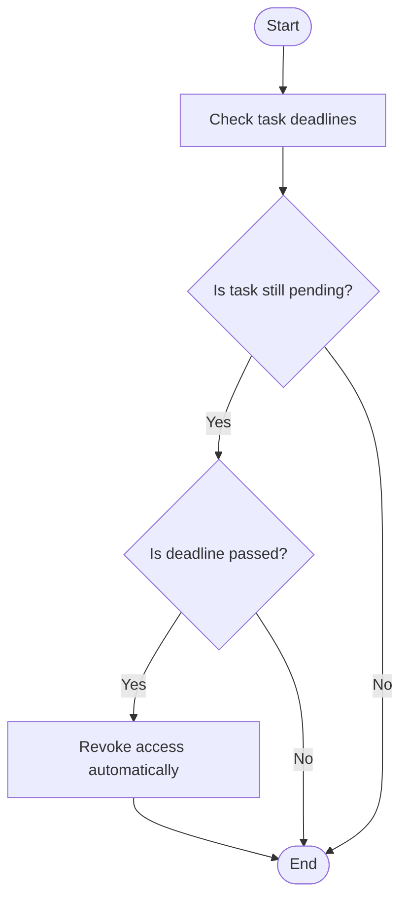
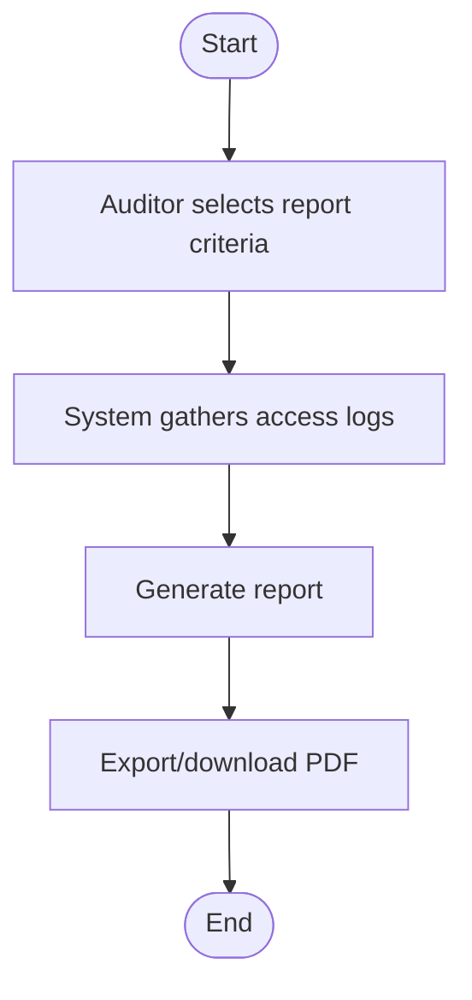
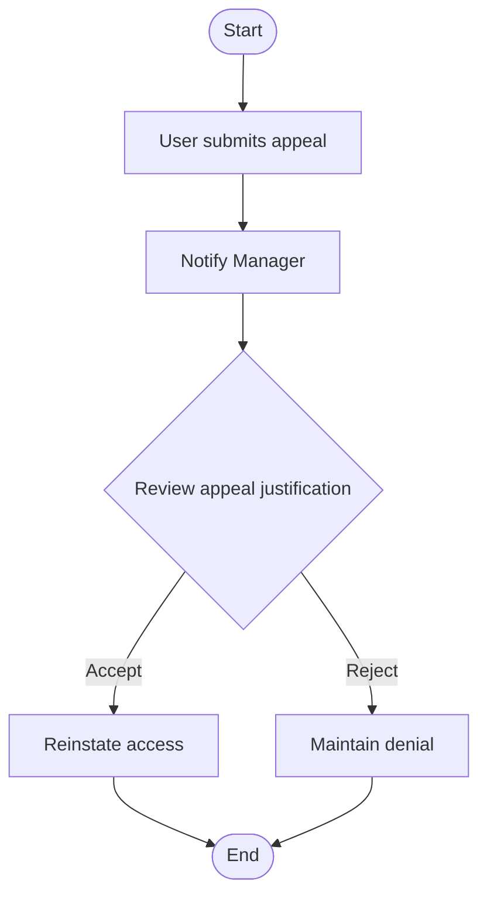
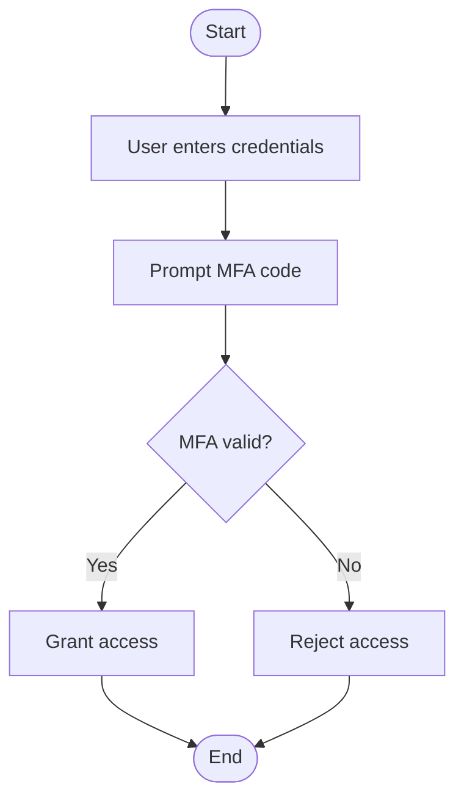
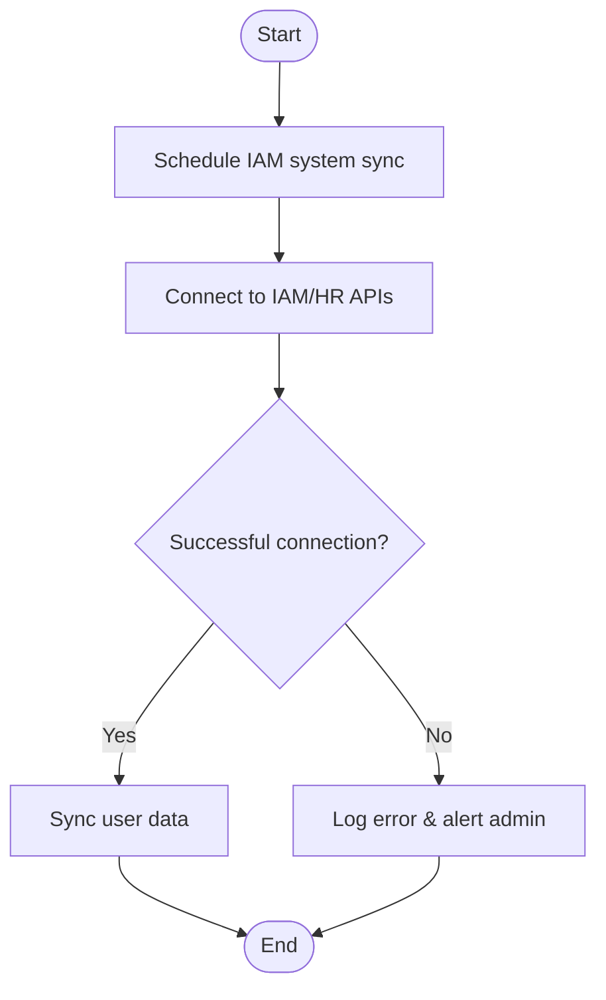

# Activity Diagrams

---
Workflow 1: Schedule Access Review Cycle
---

---
Workflow 2: Assign Reviewer to Task
---

---
Workflow 3: Access Review Execution
---

---
Workflow 4: Auto-Revoke Unapproved Access
---

Workflow 5: Generate Compliance Report
---

---
Workflow 6: Access Appeal Process
---

---
Workflow 7: MFA Authentication on Login
---

---
Workflow 8: Real-Time IAM Data Sync
---

