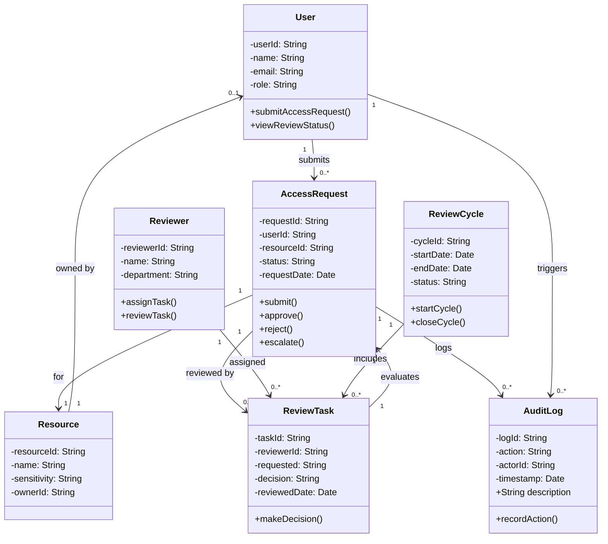

# Below is the class diagram for Mermaid.js.
It includes Classes, Relationships, and Multiplicity

**AccessRequest** status has these values: Pending, Approved, Rejected, Escalated.

**ReviewCycle** is used to group tasks under a review period.

**Resource sensitivity** is used for risk-based access control.

