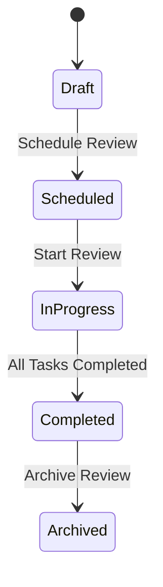
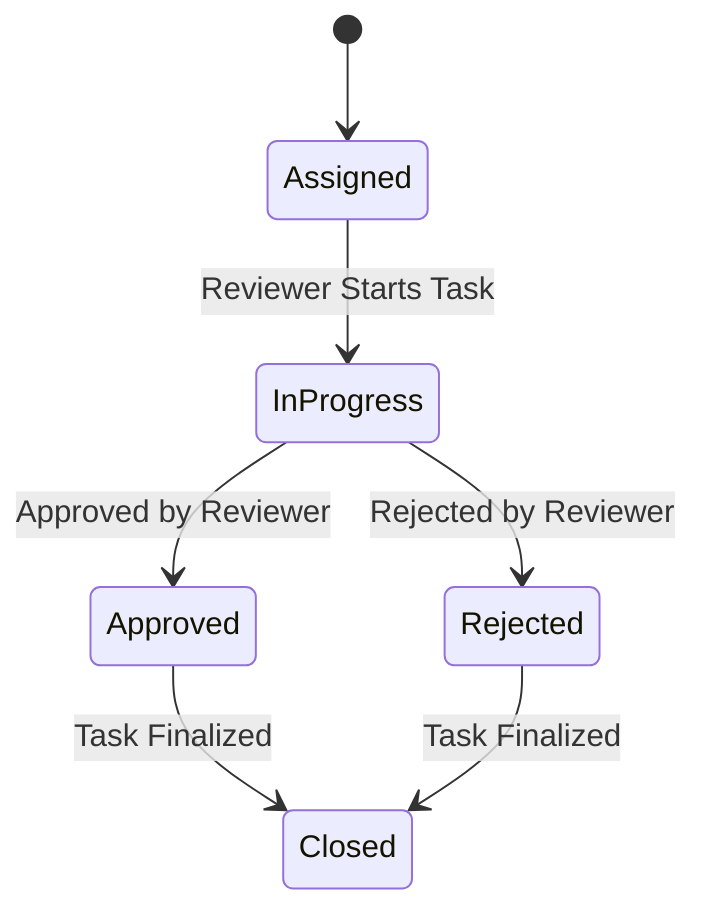
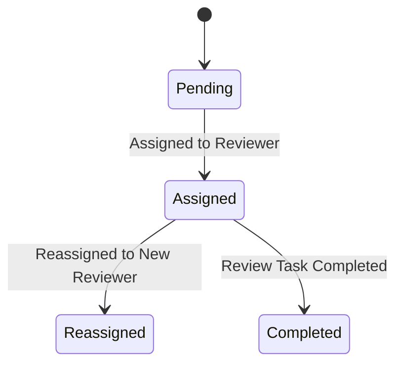
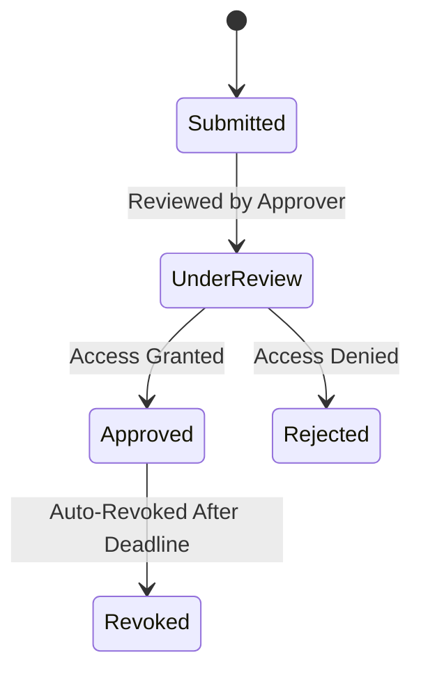
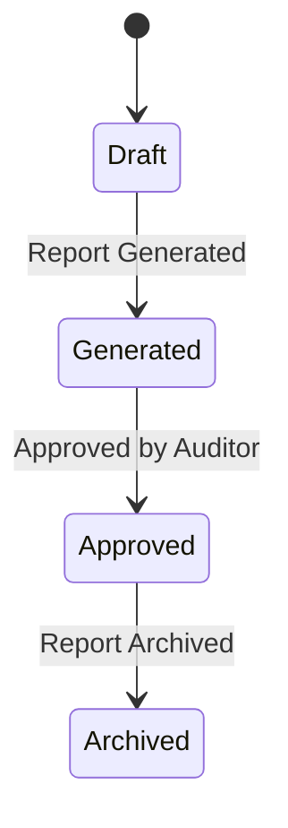
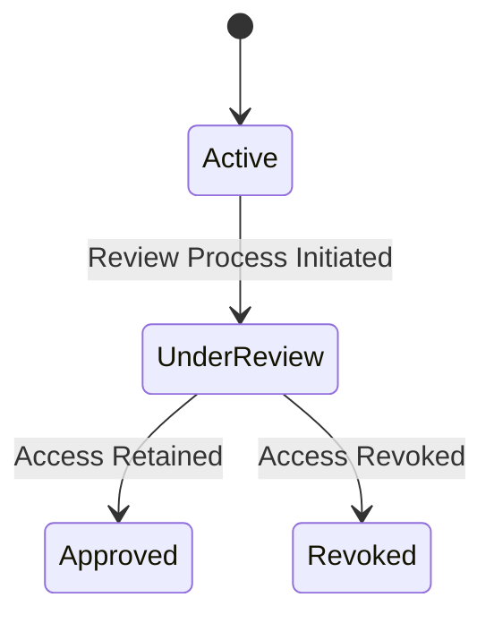
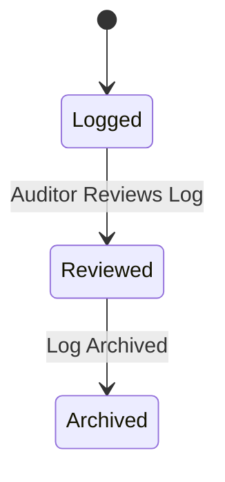
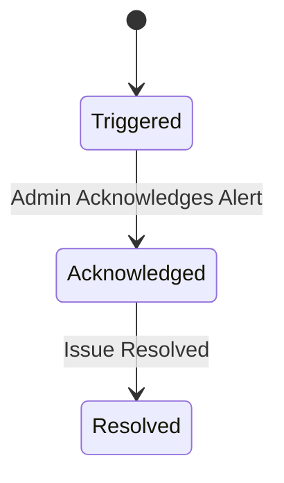

# 1. Review Cycle

**Key States and Transitions**

**Draft** → Initial state where the review cycle is created.

**Scheduled** → The review cycle is scheduled for execution.

**In Progress** → Active phase where reviewers complete tasks.

**Completed** → All tasks are finished, and the review cycle concludes.

**Archived** → Review cycle is stored for historical purposes.

**Mapping to Functional Requirements**

**FR-01:** "Schedule periodic access reviews" → Transition from Draft to Scheduled.

**FR-06:** "Unapproved access must be revoked." → Review cycle moves to Completed, triggering revocations.

**FR-04:** "Generate compliance reports" → Completed review cycles support compliance reporting.

# 2. Review Task

**Key States and Transitions**
**Assigned** → Task is assigned to a reviewer.

**In Progress** → The reviewer begins evaluating access.

**Approved/Rejected** → Decision made on access request.

**Closed** → Task is finalized.

**Mapping to Functional Requirements**
**FR-03:** "Approve or reject user access requests" → Approve/Reject transition.

**FR-06:** "Unapproved access must be revoked." → Rejected tasks contribute to access revocation.

# 3. Reviewer Assignment

**Key States and Transitions**
**Pending** → Waiting for a reviewer.

**Assigned** → A reviewer is responsible for a task.

**Reassigned** → The task is moved to another reviewer.

**Completed** → The assigned reviewer finishes the task.

**Mapping to Functional Requirements**
**FR-02:** "Assign reviewers to access review tasks" → Pending → Assigned transition.

**FR-07:** "End users can appeal rejected requests." → If reassigned, a different reviewer may evaluate access.

# 4. Access Request

**Key States and Transitions**
**Submitted** → The request is waiting for review.

**Under Review** → Approvers evaluate the request.

**Approved** → Access is granted.

**Rejected** → Request is denied.

**Revoked** → Access is withdrawn due to policy or expiration.

**Mapping to Functional Requirements**
**FR-03:** "Approve or reject access requests" → Under Review → Approved/Rejected.

**FR-06:** "Auto-revoke unapproved access" → Approved → Revoked transition.

# 5. Compliance Report

**Key States & Transitions**
**Draft** → Initial state where the report is created.

**Generated** → System compiles the report.

**Approved** → Auditors review and confirm compliance.

**Archived** → Report is stored for future audits.

**Mapping to Functional Requirements**
**FR-04:** "Generate compliance reports" → Draft → Generated → Approved transition.

**FR-08:** "Auditors access detailed logs of past access reviews." → Archived reports ensure historical data retention.

# 6. User Access

**Key States and Transitions**
**Active** → User has access to a system/resource.

**Under Review** → Access is being evaluated.

**Approved** → User retains access.

**Revoked** → User loses access.

**Mapping to Functional Requirements**
**FR-06:** "Unapproved access must be revoked" → Under Review → Revoked transition.

**FR-03:** "Approve or reject access requests" → Under Review → Approved/Rejected.

# 7. Audit Log Entry

**Key States and Transitions**
**Logged** → A new audit entry is created.

**Reviewed** → The log is analyzed for compliance.

**Archived** → Log is stored for future reference.

**Mapping to Functional Requirements**
**FR-08:** "Auditors access detailed logs" → Logged → Reviewed → Archived.

**NF-04:** "All actions must be logged for compliance" → Ensures an audit trail.

# 8. System Alert

**Key States and Transitions**

**Triggered** → The system detects an issue.

**Acknowledged** → Admin confirms receipt of the alert.

**Resolved** → The issue is fixed.

**Mapping to Functional Requirements**

**NF-07:** "Provide real-time monitoring and alerts" → Triggered → Acknowledged → Resolved transition.

**NF-08:** "Ensure 99.9% uptime" → Alerts help maintain high availability.

