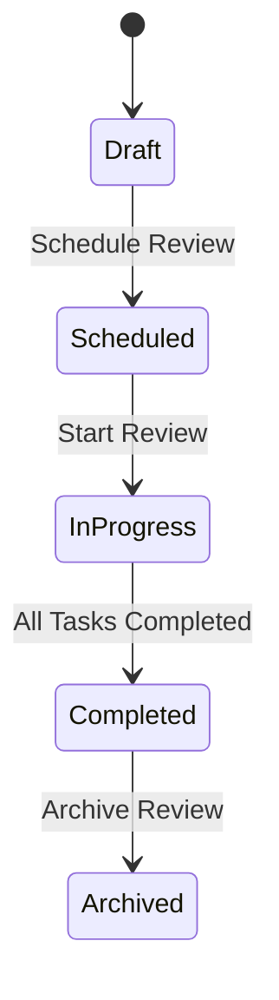
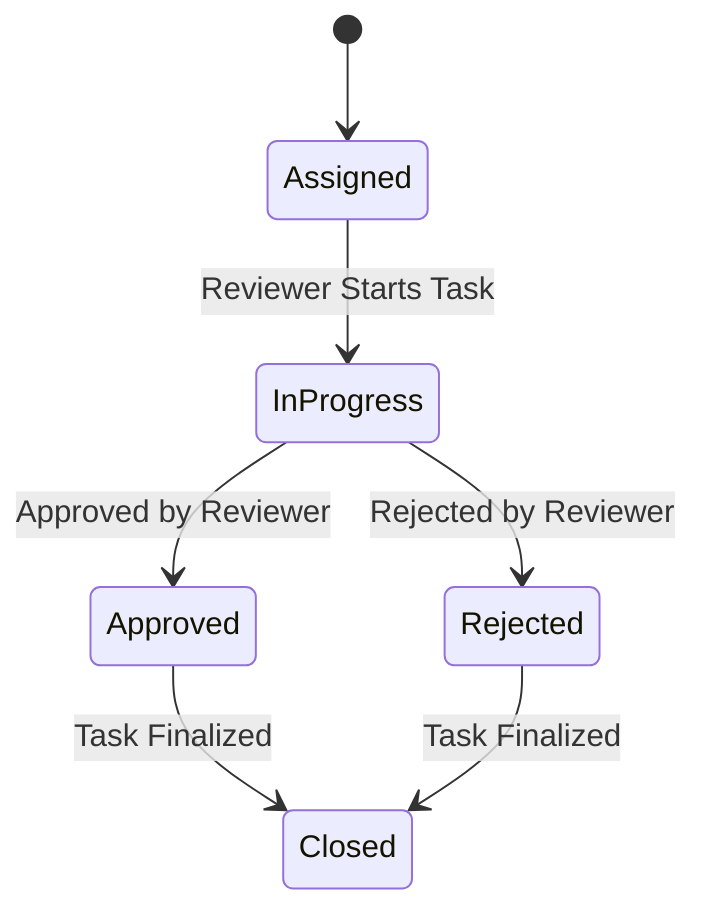
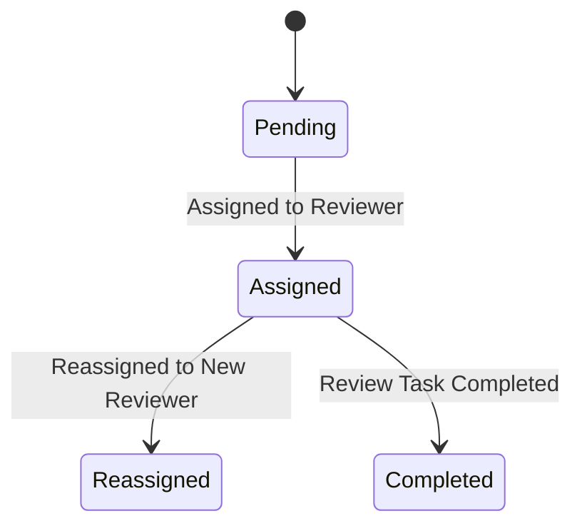
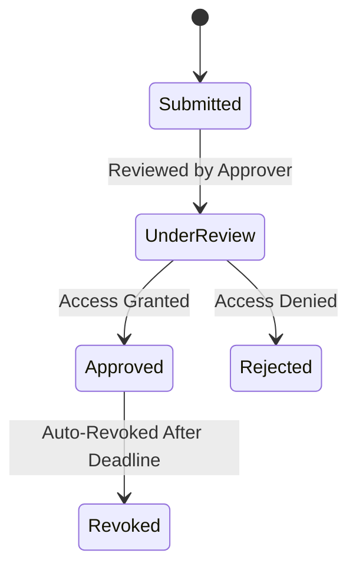
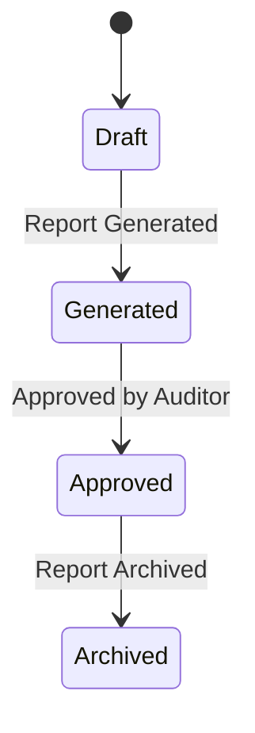
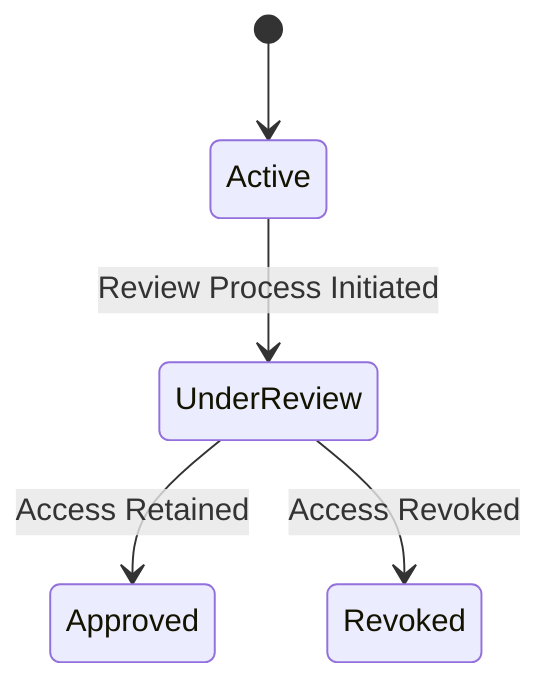
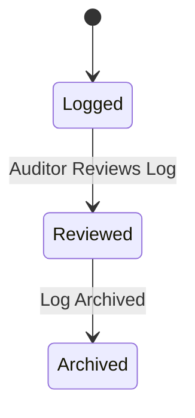
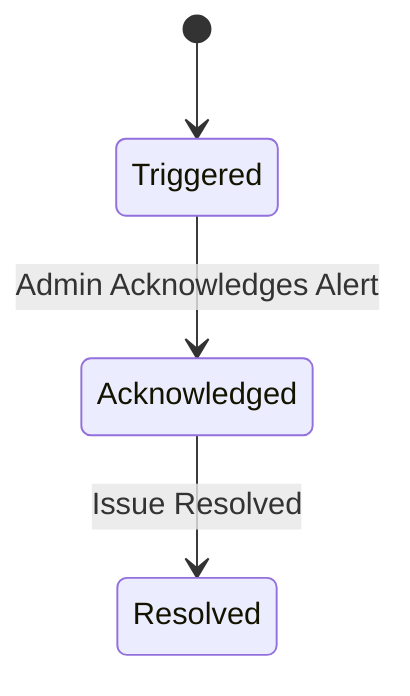

# State Diagrams

---
State 1: Review Cycle
---

---
State 2: Review Task
---

---
State 3: Reviewer Assignment
---

---
State 4: Access Request
---

---
 State 5: Compliance Report
---

---
State 6: User Access
---

---
State 7: Audit Log Entry
---

---
State 8: System Alert
---

